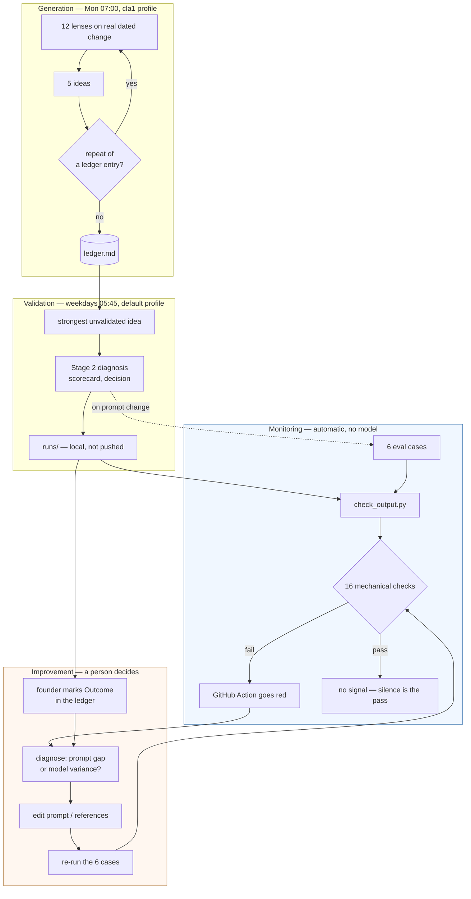

# How the system runs, and who watches it

Three loops. Two run themselves; the third needs a person, and that is deliberate.

## Who does what

| Role | Who | How often | What it actually checks |
|---|---|---|---|
| **Monitor** | `eval/check_output.py` | Every push, and every eval run | 16 falsifiable properties: section completeness, scorecard arithmetic, whether the verdict obeys the deal-breaker and threshold rules, evidence-label density, banned framework vocabulary, whether cited URLs resolve |
| **Auditor — facts** | Same script, `--check-urls` | On demand | Every cited URL resolves. Catches the one failure that costs a founder a month: a confident citation to something that does not exist |
| **Auditor — judgment** | **A person, or a fresh chat** | When a verdict looks wrong | Deliberately not automated. See below |
| **Engineer** | You, with Claude | When a check fails or an outcome contradicts a verdict | Edits the prompt, then re-runs the six cases to prove the fix did not break something else |
| **Ground truth** | The ledger's Outcome column | Whenever an idea lives or dies | The only signal from the real world. Slow, sparse, and worth more than everything above it |

## Why judgment is not automated

An LLM scoring its own analysis converges on its own preferences, not on accuracy. It will
reliably agree that its reasoning was sound, because the same weights produced both the
reasoning and the assessment of it. Running that on a schedule manufactures confidence
without adding information — and confident nonsense is worse than no monitoring, because
you stop looking.

So the automated layer only checks things with a right answer: does 61÷10 equal the stated
6.1, does a row scored 2 block a GO, does that PubMed URL load. Everything requiring taste
stays with a person, or goes to a **separate reviewer skill run in a fresh chat** — ideally
a different model — so it is at least not grading its own homework.

## The honest gap

There is still no signal telling you whether a GO was *correct*. That takes years and real
outcomes. Until then, the ledger's Outcome column is the closest thing you have, which is
why the one habit that matters is writing down why a dead idea died.

Everything else in this document is scaffolding. That column is the actual feedback loop.

## Cadence

| | When | Profile | Limit window |
|---|---|---|---|
| Generate | Mon 07:00 | cla1 | separate |
| Validate | Mon–Fri 05:45 | default | resets 05:40 |
| Check | on push | GitHub Actions | free, no model |
| Full eval | before and after any prompt edit | either | ~6 model runs |

Generation emits 5 ideas a week; validation consumes 5 a week. Balanced by design.
